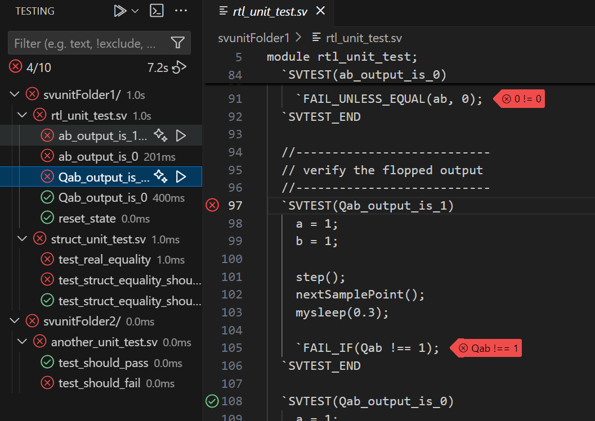

# Test Provider for SVUnit

Runs SVUnit and collects results in the VS Code Test Provider API. SVUnit must be installed separately.

## VS Code API

When files matching `*_unit_test.sv` are discovered in the workspace, the testing icon (beaker) should appear on the left side of VS Code. From there, you can run either all tests or a selection of test folders, files, and individual tests. Tests can be disabled by right-clicking and selecting "hide test". To re-enable tests, click the filter icon and select "unhide all tests".

### Navigation

Click a test name to go to the test source code.

### Test Output

In the test output (by default in the lower right corner), click the icon for "Show Test Output" for an individual test or for all tests at the top.

## How it Works

`*_unit_test.sv` files are scanned for tests and these are added to the Testing API.

When called to run tests, it will launch runSVUnit. If certain tests are selected to be included or excluded, runSVUnit will be called with appropriate `-t` and `--filter` options. These are substituted for `$TEST_SELECT` in the `svunit.runCommands` setting.

Test output is parsed and annotated back to VS Code to the corresponding test.

For each folder under the project folder which contains one or more `*_unit_test.sv` files, a test group will be created. SVUnit will be run in each of these folders when the "Run all tests" button is chosen, or in just one of the folders if a lower-level run is selected.

## Configuration

Settings can be accessed via File->Preferences->Settings, and then navigate to the SVUnit extension (or search for svunit).

Note that runSVUnit will be launched inside a shell as `/bin/sh -c '$COMMAND'`.

- `svunit.simulator` - Select a simulator. It will replace $SIMULATOR in the run command.
- `svunit.setupCommand` - A common command to be run before all run commands for tool setup.
- `svunit.runCommands` - A list of run commands by simulator. The first entry is the default. To customize for a specific simulator, add a line in the form: `simulator: runSVUnit ...`

## Example Test Tree

Note: This example is included under the sample/ directory inside the extension folder.

* svunitFolder1/
  * rtl_unit_test.sv
    * ab_output_is_1
    * ab_output_is_0
    * Qab_output_is_1
    * Qab_output_is_0
  * struct_unit_test.sv
    * test_real_equality
    * ...
* svunitFolder2/
  * another_unit_test.sv
    * test_should_pass
    * test_should_fail

## Screenshots

## Miscellaneous

CPU time per test can be reported for some simulators if the simulator flushes to stdout without a large buffering delay.

* xcelium - does not work
* vcs - works
* verilator - works with "runSVUnit -c '--autoflush'"